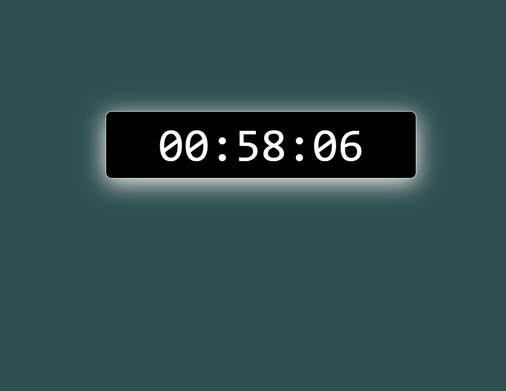

# ⏳ Countdown Timer

A simple **React** application that shows a countdown timer in the **HH:MM:SS** format, allowing users to set a time duration and see it countdown in real-time.

---

## 📌 Features
- ✅ **Real-time Countdown**: Instantly starts the countdown when a time is entered.
- ✅ **Customizable Time**: Users can enter any time in hours, minutes, and seconds.
- ✅ **Minimal UI**: Simple, clean design to show the timer.
- ✅ **Beginner Friendly**: Ideal for new React learners and simple utility apps.

---

## 🛠️ Technologies Used
- ⚛️ **React** (`useState` and `useEffect` for managing the timer and updating the UI in real-time)
- 🎨 **CSS** (`timer.css` for basic styling)
- 📄 **HTML** (JSX structure inside React component)

## 🚀 Live Demo
To see it in action, clone the repository and follow the setup instructions below.

1. **Clone the repository:**

   ```bash
   git clone https://github.com/Eshhaa11/countdown-timer
   
   
2. **Navigate to the project directory:**

   cd  countdown-timer

3. **Install dependencies:**

   npm install

4. **Start the development server:**

   npm start

5. **Open your browser and visit:**

   http://localhost:3000

---

 ## 🎨 Screenshots:
 

 ---

 ## 🤝 Contributing:
 Want to improve this project? Fork the repository, create a feature branch, and open a pull request. All contributions are welcome! 🚀✨
 
 ---

 🎉 Happy Coding!